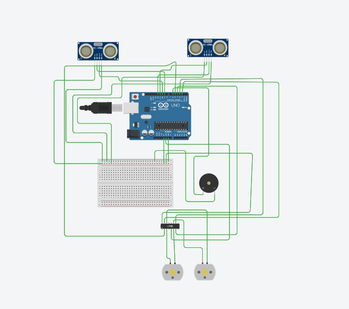
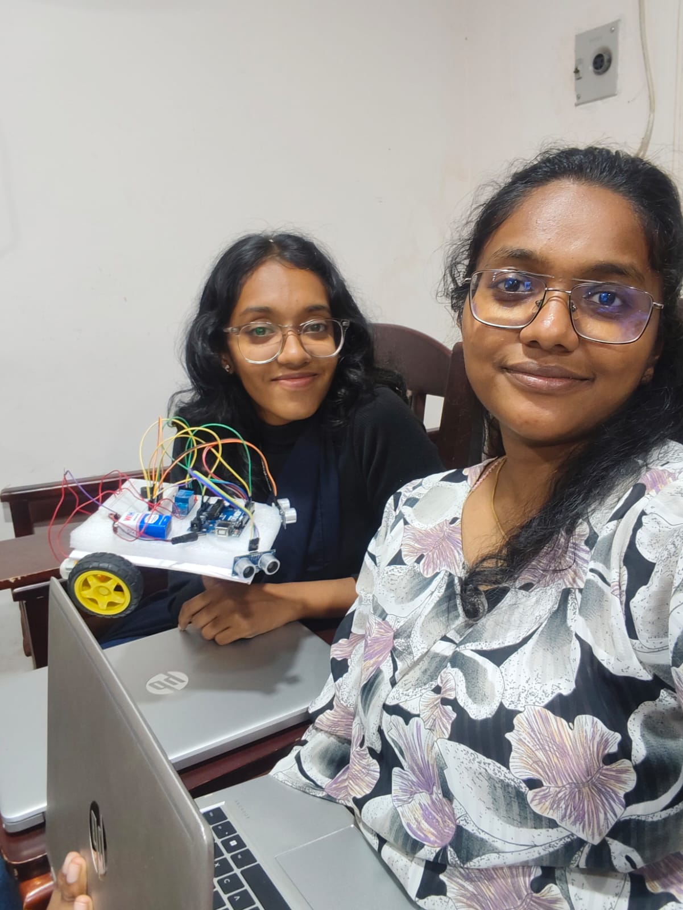
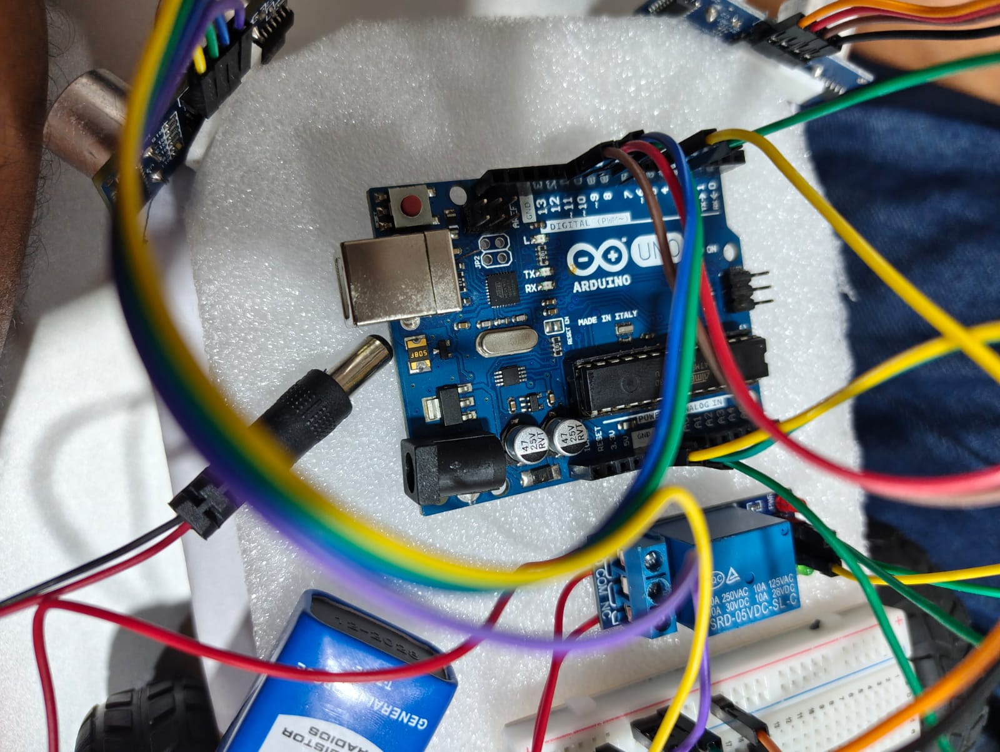

  

# [Smart Lane Intrusion Alert] 🎯

## Basic Details

### Team Name: [CyberDivas]

### Team Members
- Member 1: Isabella Ebenezer - [College of Engineering Perumon]
- Member 2: Azminsha N - [College of Engineering Perumon]

### Project Description
This project proposes a Smart Lane Change Alert System that detects vehicles entering the lane using ultrasonic sensors. When an object is detected within a safe distance, the system alerts the driver with a buzzer and automatically reduces the vehicle speed to prevent possible collisions. It demonstrates a low-cost driver assistance system for improving road safety.

### The Problem statement
Vehicles changing lane without prior alert is causing accidents. We are trying to find a solution for this

### The Solution
The easy way to solve it is using Lane Intrusion Detection System

---

## Technical Details

### Technologies/Components Used

**For Hardware:**
- Main components: [Arduino UNO, Ultrasonic Sensor (HC-SR04), Buzzer, Relay Module, DC Motor, 16x2 LCD, LED]
- Specifications: [Arduino UNO (5V operating voltage), Ultrasonic sensor detection range 2–400 cm, DC motor 5–9V, Relay module 5V, 16x2 LCD display, Piezo buzzer 5V]
- Tools required: [Breadboard, Jumper wires, USB cable, Power supply (5V), Laptop with Arduino IDE, Screwdriver]

---

## Features

List the key features of your project:
- Feature 1: Real-time obstacle detection using ultrasonic sensors.
- Feature 2: Automatic warning system using a buzzer when another vehicle enters the lane.
- Feature 3: Automatic motor speed reduction to prevent possible collisions.
- Feature 4: Low-cost and simple driver assistance prototype using Arduino.

---

## Implementation

### For Hardware:

#### Components Required
- Arduino UNO (5V microcontroller board)
- Ultrasonic Sensors HC-SR04 (2 units, detection range 2–400 cm)
- Relay Module (5V)
- DC Motor
- Piezo Buzzer (5V)
- 16×2 LCD Display
- LED indicator
- Breadboard
- Jumper wires
- USB cable / 5V power supply

#### Circuit Setup
1. Connect the ultrasonic sensors' VCC to 5V and GND to the ground of the Arduino.
2. Connect the TRIG and ECHO pins of the ultrasonic sensors to digital pins of the Arduino.
3. Connect the relay control pin to Arduino digital pin 4 to control the DC motor.
4. Connect the buzzer to Arduino pin 6 and GND.
5. Connect the DC motor through the relay module so that the Arduino can control the motor power.
6. Connect the 16×2 LCD display and LED indicators to display system status and alerts.
7. Power the Arduino using a USB cable or a 5V power supply.

---

## Project Documentation

### For Hardware:

#### Schematic & Circuit

*Figure 1: Circuit diagram of the Smart Lane Change Alert System. Two ultrasonic sensors are connected to the Arduino Uno to detect obstacles in nearby lanes. The buzzer is connected to pin 6 to provide an alert when a vehicle is detected within the threshold distance, and a relay connected to pin 4 controls the DC motor to reduce the speed.*

*Figure 2: Schematic diagram showing the working principle of the system. Ultrasonic sensors measure the distance of nearby vehicles and send the data to the Arduino. When the distance is below the safe limit, the Arduino activates the buzzer and controls the relay to slow down the motor.*

#### Build Photos

*Team members working on the Smart Lane Change Alert System prototype during the hackathon.*

*Components used in the project: Arduino Uno, ultrasonic sensors (HC-SR04), relay module, DC motor, buzzer, breadboard, jumper wires, power supply, and connecting cables.*

*Final prototype of the Smart Lane Change Alert System demonstrating obstacle detection using ultrasonic sensors, driver alert through a buzzer, and automatic motor control through a relay for improved lane safety.*

---

### For Hardware Projects:

#### Bill of Materials (BOM)

| Component | Quantity | Specifications | Price | Link/Source |
|-----------|----------|----------------|-------|-------------|
| Arduino Uno | 1 | ATmega328P, 16MHz | ₹250 | [Link] |
| LED | 5 | Red, 5mm, 20mA | ₹5 each | [Link] |
| Resistor | 5 | 220Ω, 1/4W | ₹1 each | [Link] |
| Breadboard | 1 | 830 points | ₹100 | [Link] |
| Jumper Wires | 20 | Male-to-Male | ₹50 | [Link] |
| [BC MOTOR] | 1 each| ₹20| | |

**Total Estimated Cost:** ₹[1000]

#### Assembly Instructions

**Step 1: Prepare Components**
1. Gather all components listed in the BOM
2. Check component specifications
3. Prepare your workspace

*Caption: All components laid out*

**Step 2: Build the Power Supply**
1. Connect the power rails on the breadboard
2. Connect Arduino 5V to breadboard positive rail
3. Connect Arduino GND to breadboard negative rail

*Caption: Power connections completed*

**Step 3: Add Components**
1. Place LEDs on breadboard
2. Connect resistors in series with LEDs
3. Connect LED cathodes to GND
4. Connect LED anodes to Arduino digital pins (2-6)

*Caption: LED circuit assembled*

**Step 4: [Continue for all steps...]**

**Final Assembly:**

*Caption: Completed project ready for testing*

---

## Project Demo

[Demo Video](https://drive.google.com/file/d/1f-2VLM8z8T_Al_7oRrIkeHmiQFCU4Ugj/view?usp=sharing)

*Click the image to watch the project demonstration video.*

---

## AI Tools Used (Optional - For Transparency Bonus)

If you used AI tools during development, document them here for transparency:

**Tool Used:** [Chatgpt]

**Percentage of AI-generated code:** [Approximately 40%]

**Human Contributions:**
- Architecture design and planning
- Custom business logic implementation
- Integration and testing
- UI/UX design decisions

*Note: Proper documentation of AI usage demonstrates transparency and earns bonus points in evaluation!*

---

## Team Contributions

- [Isabella Ebenezer]: [simulated the circuit and implemeted the physical hardware]
- [Azminsha N ]: [Proposed the idea , brainstorming the circuit design , checking final output]

---

## License

This project is licensed under the [LICENSE_NAME] License - see the [LICENSE](LICENSE) file for details.

**Common License Options:**
- MIT License (Permissive, widely used)
- Apache 2.0 (Permissive with patent grant)
- GPL v3 (Copyleft, requires derivative works to be open source)

---

Made with ❤️ at TinkerHub
